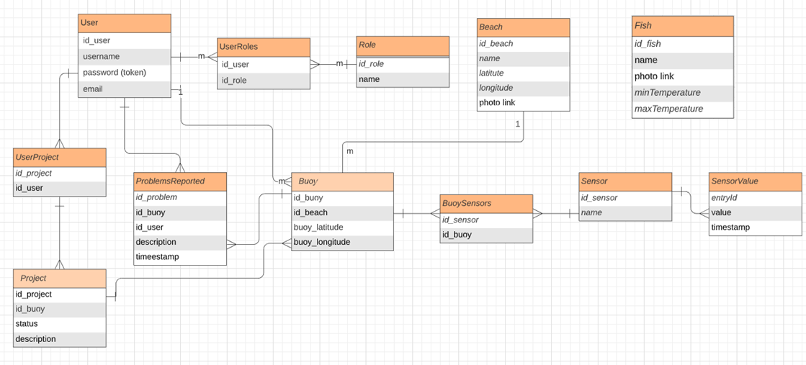

## Database
MySQL : https://dev.mysql.com/downloads/installer/  
I have the following entities:
- User : id, username, email, password (Encoded) & list of the <b>Buoy</b>s he's taking care of
- Role : id, name
- Project : id, status, description & list of buoys for which the project was of interest
- Buoy : id, GPS coordinates (latitude, longitude) & a set of <b>Sensor</b>s 
- Beach : id, name, GPS coordinates, link to the photo & list of <b>Buoy</b>s that belong to this beach
- Sensor : id, name & list of <b>Sensor value</b>s
- Sensor value : idSensor, entryId, value, timestamp
- Problems reported : id, <b>User</b>, <b>Buoy</b>, description and timestamp
- Fish : id, name, link to the photo, water temperature preferences (minim, maximum)

## Development environment 
IntelliJ IDEA : https://www.jetbrains.com/idea/download/#section=windows  
I have used the Ultimate version.

## APIs
1. Signup: POST http://localhost:8080/api/auth/signup
2. Signin: POST http://localhost:8080/api/auth/signin
3. Get a user's profile: http://localhost:8080/api/users/{username}
4. Get a given beach information: http://localhost:8080/api/beaches/{beachId}
5. Get a list with all the beaches: http://localhost:8080/api/beaches
6. Get a given buoy's summary: http://localhost:8080/api/buoys/{buoyId}
7. Get a list with all the buoys: http://localhost:8080/api/buoys
8. Get all the buoys from a given beach: http://localhost:8080/api/beach/{beachId}/buoys
9. Get a list with all the projects: http://localhost:8080/api/projects
10. Get all the details about all the sensors: http://localhost:8080/api/sensors
11. Get all the projects for a given buoy: http://localhost:8080/api/buoy/{buoyId}/projects
12. Get a list with all the problems reported: http://localhost:8080/api/problems
13. Get all the fish: http://localhost:8080/api/fishes
14. Create a beach: POST http://localhost:8080/api/beach/create
15. Create a buoy: POST http://localhost:8080/api/buoy/create
16. Create a project: POST http://localhost:8080/api/project/create
17. Report a problem: POST http://localhost:8080/api/problem/create
18. Create new fish entry: POST http://localhost:8080/api/fish/create
19. Allow admin to set a reported problem as solved: PUT http://localhost:8080/api/problem/{problemId}

